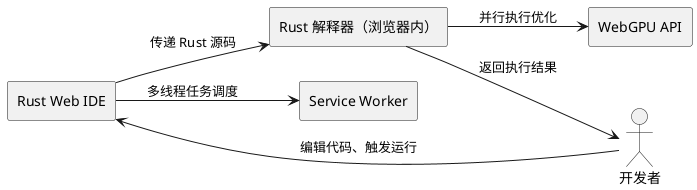
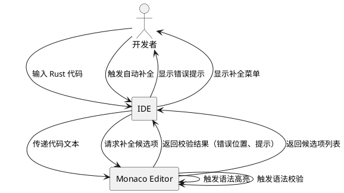
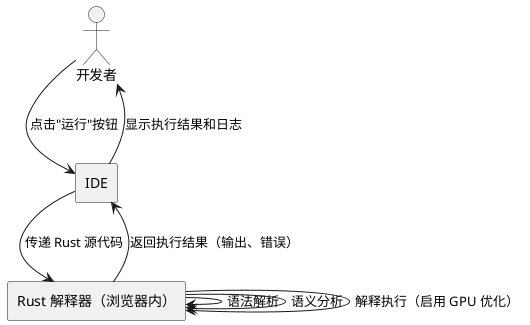
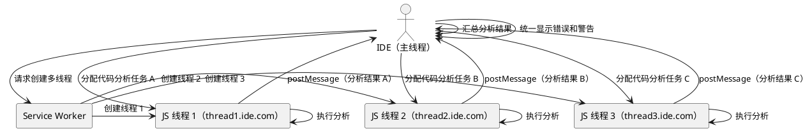
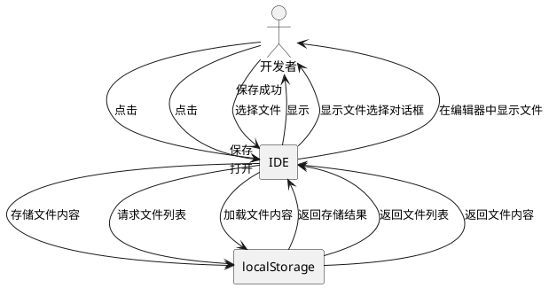
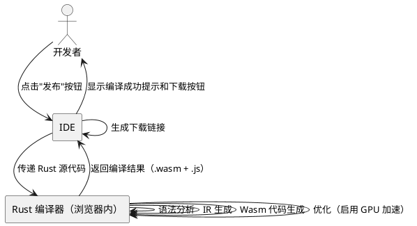

# **1. 组件定位**

## **1.1 核心职责**

本组件负责提供浏览器内 Rust 代码编辑、解释执行的一体化开发环境，实现零安装、零编译、即时运行的纯 Web 开发体验。

## **1.2 核心输入**

1. 用户输入的 Rust 源代码（\.rs 文件）
2. 用户操作指令（运行、保存、打开文件）
3. 项目配置文件（Cargo\.toml）
4. GPU 执行优化配置参数

## **1.3 核心输出**

1. Rust 代码执行结果和输出日志
2. 错误提示和定位信息
3. 持久化的用户文件（存储于 localStorage）
4. 发布编译生成的 Wasm 产物（未来功能）

## **1.4 职责边界**

1. 不负责本地文件系统访问（仅使用浏览器 localStorage）
2. 不负责实时编译生成 Wasm（采用解释执行模式）
3. 不负责多项目或多 crate 管理（仅支持单项目单 crate）
4. 不负责高级调试功能（如断点、单步执行，暂不实现）
5. 不负责云端存储和协作功能（暂不实现）

# **2. 领域术语**

**Rust 解释器**
: 在浏览器内直接解释执行 Rust 源码的运行时环境，无需编译即可执行 Rust 代码。

**单项目单 crate**
: IDE 仅支持一个项目，且该项目包含且仅包含一个 Rust crate（库或可执行程序）。

**解释执行**
: 直接解析并执行源代码，而非先编译为二进制格式再执行。

**GPU 执行优化**
: 利用 GPU 并行计算能力加速 Rust 代码的解释执行过程，通过 WebGPU API 在浏览器内实现。

**多域名多 JS 线程**
: 通过注册多个子域名，利用浏览器的同源策略获得多个独立的 JavaScript 执行线程，实现并行代码分析。

**Wasm 发布编译**
: 在发布阶段将 Rust 源码编译为 Wasm 二进制产物，用于生产环境部署（未来功能）。

**localStorage**
: 浏览器提供的本地存储机制，用于持久化用户文件，避免会话丢失。

# **3. 角色与边界**

## **3.1 核心角色**

开发者：使用本 IDE 编写和解释执行 Rust 代码的用户。

## **3.2 外部系统**

1. Rust 解释器：在浏览器内解释执行 Rust 源码
2. WebGPU API：提供 GPU 并行计算能力，用于执行优化
3. Service Worker：支持多域名下的 JS 线程管理和资源加载

## **3.3 交互上下文**



# **4. DFX约束**

## **4.1 性能**

1. 代码编辑响应时间应小于 100ms（包括语法校验和自动补全）
2. 小型代码片段（<100 行）的解释执行启动时间应小于 500ms
3. GPU 执行优化应将执行速度提升至少 1\.5 倍（相比纯 CPU 解释）
4. 多线程代码分析应支持至少 4 个并行分析任务

## **4.2 可靠性**

1. 解释执行过程不应导致浏览器崩溃
2. localStorage 文件读写成功率应达到 100%
3. 运行失败时应提供明确的错误提示和定位信息
4. 多线程任务失败时应自动降级为单线程执行

## **4.3 安全性**

1. 用户代码应在沙箱环境中运行，不应访问敏感浏览器 API
2. 多域名线程间通信应使用 postMessage，避免跨域安全风险
3. 解释器应限制内存和 CPU 使用，防止恶意代码占用资源

## **4.4 可维护性**

1. 应提供执行日志的导出功能
2. 应记录性能指标（执行时间、GPU 利用率、线程数量）
3. 应支持插件扩展接口，便于后续功能增强

## **4.5 兼容性**

1. 应支持 Chrome 90+、Edge 90+、Firefox 90+、Safari 15+
2. 应支持 WebGPU API（或提供降级方案）
3. 应兼容移动端浏览器（响应式布局）

# **5. 核心能力**

## **5.1 代码编辑**

### **5.1.1 业务规则**

1. **语法高亮规则**：编辑器必须为 Rust 代码提供语法高亮，支持关键字、字符串、注释、宏等元素的差异化显示。

   a. 验收条件：[用户输入 Rust 代码] → [关键字显示为蓝色，字符串显示为绿色，注释显示为灰色]

2. **自动补全规则**：编辑器必须提供 Rust 代码自动补全，包括内置函数、标准库 API、用户定义函数等。

   a. 验收条件：[用户输入 "pri"] → [自动提示 "print\!"、"println\!" 等候选项]

3. **语法校验规则**：编辑器必须实时校验 Rust 代码语法，错误位置应高亮显示并附带错误提示。

   a. 验收条件：[用户输入不完整代码 "fn main("] → [在 "(" 位置显示红色波浪线，提示"缺少右括号"]

4. **代码格式化规则**：编辑器必须支持 Rust 代码格式化（rustfmt），一键整理代码缩进、换行、空格。

   a. 验收条件：[用户点击格式化按钮] → [代码按照 Rust 官方风格规范重新排列]

### **5.1.2 交互流程**



### **5.1.3 异常场景**

1. **语法校验失败**

   a. 触发条件：[用户输入不符合 Rust 语法的代码]

   b. 系统行为：[实时标记错误位置，生成错误提示信息]

   c. 用户感知：[编辑器中显示红色波浪线和错误提示框]

2. **自动补全服务不可用**

   a. 触发条件：[语法分析模块加载失败或响应超时]

   b. 系统行为：[禁用自动补全功能，记录错误日志]

   c. 用户感知：[无补全提示，编辑功能正常]

## **5.2 Rust 解释执行**

### **5.2.1 业务规则**

1. **执行触发规则**：用户点击"运行"按钮时，系统必须在浏览器内启动 Rust 解释器，直接解释执行源代码，无需编译。

   a. 验收条件：[用户点击运行按钮] → [在浏览器内启动 Rust 解释器，逐行解释执行代码]

2. **执行输出规则**：执行过程中，系统必须捕获并展示 println\!、eprintln\! 等输出。

   a. 验收条件：[代码执行 println\!("Hello")] → [日志区域显示"Hello"]

3. **错误捕获规则**：执行错误（如 panic）必须被捕获并展示给用户，包括错误位置和堆栈信息。

   a. 验收条件：[代码执行 panic!("error")] → [日志区域显示"panic: error"及堆栈信息，并终止执行]

4. **执行缓存规则**：相同代码的重复执行应利用缓存，避免重复解析。

   a. 验收条件：[用户重复执行相同代码] → [从缓存加载解析结果，启动时间 < 200ms]

5. **禁止项**：禁止在开发阶段编译生成 Wasm，仅支持解释执行。

   a. 验收条件：[用户点击运行按钮] → [执行解释模式，不生成 .wasm 文件]

### **5.2.2 交互流程**



### **5.2.3 异常场景**

1. **执行失败**

   a. 触发条件：[代码存在运行时错误（如数组越界、空指针）]

   b. 系统行为：[解释器捕获错误，生成错误信息和堆栈]

   c. 用户感知：[日志区域显示错误详情和堆栈信息]

2. **解释器加载失败**

   a. 触发条件：[Rust 解释器模块加载超时或失败]

   b. 系统行为：[显示友好错误提示，提供重试按钮]

   c. 用户感知：[提示"解释器加载失败，请刷新页面重试"]

3. **内存不足**

   a. 触发条件：[执行代码导致浏览器内存不足]

   b. 系统行为：[终止执行，释放内存，记录错误日志]

   c. 用户感知：[提示"内存不足，请减少代码复杂度"]

4. **执行超时**

   a. 触发条件：[代码执行时间超过限制（如 30s）]

   b. 系统行为：[终止执行，释放资源]

   c. 用户感知：[提示"执行超时，已终止"]

## **5.3 GPU 执行优化**

### **5.3.1 业务规则**

1. **GPU 加速规则**：当浏览器支持 WebGPU API 时，系统必须利用 GPU 并行计算能力加速 Rust 代码的解释执行。

   a. 验收条件：[浏览器支持 WebGPU] → [启用 GPU 执行优化，执行速度提升 >= 1\.5 倍]

2. **GPU 任务调度规则**：系统必须将可并行执行的代码片段分配到 GPU 计算，如数值计算、数组操作等。

   a. 验收条件：[执行包含大量数值计算的代码] → [GPU 加速执行，GPU 利用率 >= 30%]

3. **GPU 降级规则**：当浏览器不支持 WebGPU 或 GPU 初始化失败时，系统必须自动降级为纯 CPU 解释执行。

   a. 验收条件：[浏览器不支持 WebGPU] → [使用 CPU 解释执行，UI 提示"未启用 GPU 加速"]

4. **GPU 资源限制规则**：GPU 执行应限制显存使用，避免占用过多 GPU 资源影响其他应用。

   a. 验收条件：[执行过程] → [GPU 显存占用 < 256MB]

### **5.3.2 交互流程**

```plantuml
@startuml
actor "IDE" as IDE
rectangle "GPU 执行优化模块" as GPUModule
rectangle "WebGPU API" as GPU

IDE -> GPUModule : 请求执行优化
GPUModule -> GPU : 检查 WebGPU 支持
GPU --> GPUModule : 返回支持状态
alt WebGPU 支持
    GPUModule -> GPU : 初始化 GPU 设备
    GPUModule -> GPUModule : 识别可并行代码片段
    GPUModule -> GPU : 提交并行计算任务
    GPU --> GPUModule : 返回计算结果
    GPUModule --> IDE : 返回优化后的执行结果
else WebGPU 不支持
    GPUModule --> IDE : 返回 CPU 执行结果
end
@enduml
```

### **5.3.3 异常场景**

1. **WebGPU 初始化失败**

   a. 触发条件：[浏览器支持 WebGPU 但初始化失败（如驱动问题）]

   b. 系统行为：[降级为 CPU 执行，记录警告日志]

   c. 用户感知：[提示"GPU 加速不可用，已切换到 CPU 执行"]

2. **GPU 计算超时**

   a. 触发条件：[GPU 计算任务执行时间超过限制（如 5s）]

   b. 系统行为：[取消 GPU 任务，降级为 CPU 计算]

   c. 用户感知：[提示"GPU 计算超时，已切换到 CPU 执行"]

3. **GPU 内存不足**

   a. 触发条件：[GPU 显存不足以容纳计算任务]

   b. 系统行为：[减小任务规模或降级为 CPU 执行]

   c. 用户感知：[提示"GPU 内存不足，已优化任务规模"]

## **5.4 多域名多 JS 线程代码分析**

### **5.4.1 业务规则**

1. **多线程启用规则**：系统必须支持通过注册多个子域名（如 thread1\.ide\.com, thread2\.ide\.com）获得多个独立的 JavaScript 执行线程。

   a. 验收条件：[配置多域名] → [系统在每个域名下创建独立的 JS 线程，支持并行代码分析]

2. **任务分配规则**：当启用多线程时，系统必须将代码分析任务（如语法校验、类型检查、自动补全）分配到不同线程并行执行。

   a. 验收条件：[编辑大型代码文件] → [代码分析任务在不同线程中并行执行，响应时间缩短]

3. **线程通信规则**：不同域名下的 JS 线程必须使用 postMessage 进行通信，避免跨域安全风险。

   a. 验收条件：[线程间通信] → [使用 postMessage API，不直接访问其他线程的变量]

4. **结果汇总规则**：所有线程的分析结果必须汇总到主线程，统一展示给用户。

   a. 验收条件：[所有线程完成分析] → [主线程汇总结果，统一显示错误和警告]

5. **降级规则**：当多域名配置失败或 Service Worker 不可用时，系统必须降级为单线程分析。

   a. 验收条件：[多域名配置失败] → [使用单线程分析，UI 提示"未启用多线程加速"]

### **5.4.2 交互流程**



### **5.4.3 异常场景**

1. **线程创建失败**

   a. 触发条件：[子域名无法访问或 Service Worker 初始化失败]

   b. 系统行为：[降级为单线程分析，记录错误日志]

   c. 用户感知：[提示"多线程不可用，已切换到单线程分析"]

2. **线程通信失败**

   a. 触发条件：[postMessage 调用失败或消息丢失]

   b. 系统行为：[重试通信，超过重试次数后降级为单线程]

   c. 用户感知：[提示"线程通信异常，已切换到单线程分析"]

3. **线程超时**

   a. 触发条件：[某个线程分析任务超时（如 10s）]

   b. 系统行为：[取消该线程任务，由其他线程接管]

   c. 用户感知：[提示"某个线程超时，已重新分配任务"]

## **5.5 文件管理**

### **5.5.1 业务规则**

1. **文件创建规则**：用户必须能够创建新的 Rust 源文件（\.rs）。

   a. 验收条件：[用户点击"新建文件"并输入文件名] → [创建新文件并在编辑器中打开]

2. **文件保存规则**：用户必须能够将当前编辑的文件保存到 localStorage。

   a. 验收条件：[用户点击"保存"] → [文件存储到 localStorage，显示"保存成功"提示]

3. **文件打开规则**：用户必须能够从 localStorage 打开已保存的文件。

   a. 验收条件：[用户点击"打开"并选择文件] → [文件加载到编辑器]

4. **文件导出规则**：用户必须能够下载源文件（\.rs）和项目配置文件（Cargo\.toml）。

   a. 验收条件：[用户点击"下载"] → [浏览器下载指定文件]

5. **自动恢复规则**：用户下次打开 IDE 时，系统必须自动恢复上次编辑的文件。

   a. 验收条件：[用户关闭并重新打开 IDE] → [自动加载上次编辑的文件]

### **5.5.2 交互流程**



### **5.5.3 异常场景**

1. **localStorage 读写失败**

   a. 触发条件：[localStorage 已满或浏览器禁用存储]

   b. 系统行为：[显示错误提示，建议用户导出文件]

   c. 用户感知：[提示"存储失败，请导出文件避免丢失"]

2. **文件不存在**

   a. 触发条件：[用户尝试打开已删除的文件]

   b. 系统行为：[从文件列表中移除，显示提示]

   c. 用户感知：[提示"文件不存在或已被删除"]

## **5.6 项目管理（单项目单 crate）**

### **5.6.1 业务规则**

1. **项目唯一性规则**：IDE 必须仅支持一个项目，不支持多项目切换或管理。

   a. 验收条件：[IDE 启动] → [自动创建或加载唯一项目，不提供项目切换功能]

2. **crate 唯一性规则**：项目必须包含且仅包含一个 Rust crate，不支持多 crate 工作空间（workspace）。

   a. 验收条件：[项目结构] → [仅包含一个 Cargo\.toml，不允许多 crate 配置]

3. **项目结构规则**：项目必须遵循标准 Rust 项目结构，包含 src 目录、Cargo\.toml 文件。

   a. 验收条件：[项目初始化] → [自动创建 src/main\.rs（或 src/lib\.rs）和 Cargo\.toml]

4. **禁止项**：禁止支持多项目、多 crate、workspace 配置。

   a. 验收条件：[项目配置] → [不支持 \[workspace\] 配置，不支持多 Cargo\.toml]

### **5.6.2 交互流程**

```plantuml
@startuml
actor "IDE" as IDE
rectangle "项目管理模块" as Project
rectangle "localStorage" as Storage

IDE -> Project : 初始化项目
Project -> Storage : 检查已存在项目
alt 项目已存在
    Storage --> Project : 返回项目数据
    Project --> IDE : 加载项目
else 项目不存在
    Project -> Project : 创建默认项目结构
    Project -> Storage : 存储项目数据
    Project --> IDE : 初始化新项目
end
@enduml
```

### **5.6.3 异常场景**

1. **项目数据损坏**

   a. 触发条件：[localStorage 中的项目数据损坏或格式错误]

   b. 系统行为：[提示用户，提供重置项目选项]

   c. 用户感知：[提示"项目数据损坏，是否重置为默认项目？"]

2. **Cargo\.toml 缺失**

   a. 触发条件：[项目缺少 Cargo\.toml 文件]

   b. 系统行为：[自动生成默认 Cargo\.toml]

   c. 用户感知：[提示"已自动创建 Cargo\.toml"]

## **5.7 发布编译（未来功能）**

### **5.7.1 业务规则**

1. **编译触发规则**：用户点击"发布"按钮时，系统必须在浏览器内启动编译流程，将 Rust 源码编译为 Wasm 产物。

   a. 验收条件：[用户点击发布按钮] → [在浏览器内启动 Rust 到 Wasm 编译，生成 .wasm 文件]

2. **编译输出规则**：编译成功时，系统必须生成 \.wasm 文件和配套的 JS 胶水代码，并提供下载链接。

   a. 验收条件：[编译成功] → [生成 project\.wasm 和 project\.js 文件，UI 显示下载按钮]

3. **编译日志规则**：编译过程中，系统必须实时收集并展示编译日志，包括警告、错误、优化信息。

   a. 验收条件：[编译过程中] → [日志区域实时显示编译输出，包括进度、警告、错误]

4. **禁止项**：禁止在开发阶段触发编译，仅允许在发布阶段编译。

   a. 验收条件：[用户点击运行按钮] → [执行解释模式，不触发编译]

### **5.7.2 交互流程**



### **5.7.3 异常场景**

1. **编译失败**

   a. 触发条件：[代码存在语法错误或类型错误]

   b. 系统行为：[编译器返回错误信息，IDE 解析错误位置]

   c. 用户感知：[日志区域显示错误详情，编辑器中标记错误位置]

2. **编译器加载失败**

   a. 触发条件：[Rust 编译器模块加载超时或失败]

   b. 系统行为：[显示友好错误提示，提供重试按钮]

   c. 用户感知：[提示"编译器加载失败，请刷新页面重试"]

3. **内存不足**

   a. 触发条件：[编译导致浏览器内存不足]

   b. 系统行为：[终止编译，释放内存，记录错误日志]

   c. 用户感知：[提示"内存不足，请减少代码复杂度"]

# **6. 数据约束**

## **6.1 Rust 源文件**

1. **文件名**：必须符合 Rust 命名规范，仅包含字母、数字、下划线，且不以数字开头。

2. **文件扩展名**：必须为 \.rs。

3. **文件大小**：单个文件不应超过 100KB（避免性能问题）。

4. **编码格式**：必须为 UTF\-8。

## **6.2 项目配置（Cargo\.toml）**

1. **文件名**：必须为 Cargo\.toml。

2. **项目结构**：必须包含 \[package\] 段，可选包含 \[dependencies\] 段。

3. **禁止配置**：不允许包含 \[workspace\] 段。

4. **crate 类型**：必须为 bin（可执行程序）或 lib（库），不支持多 crate。

## **6.3 解释执行配置**

1. **GPU 加速开关**：布尔值，默认为 true（若浏览器支持）。

2. **多线程数量**：整数，范围 1-8，默认为 4。

3. **执行超时限制**：整数，范围 5-60（秒），默认为 30。

4. **内存限制**：整数，范围 128-1024（MB），默认为 512。

## **6.4 执行日志**

1. **日志级别**：可选值为 "error"、"warn"、"info"、"debug"，默认为 "info"。

2. **日志条目**：每条日志必须包含时间戳、级别、消息内容。

3. **日志保留**：日志应在执行完成后保留至少 24 小时（存储在 localStorage）。

## **6.5 用户配置**

1. **主题**：可选值为 "light"、"dark"，默认为 "dark"。

2. **编辑器字体大小**：整数，范围 10-24，默认为 14。

3. **自动保存开关**：布尔值，默认为 false。

4. **自动保存间隔**：整数，范围 10-300（秒），默认为 60。
